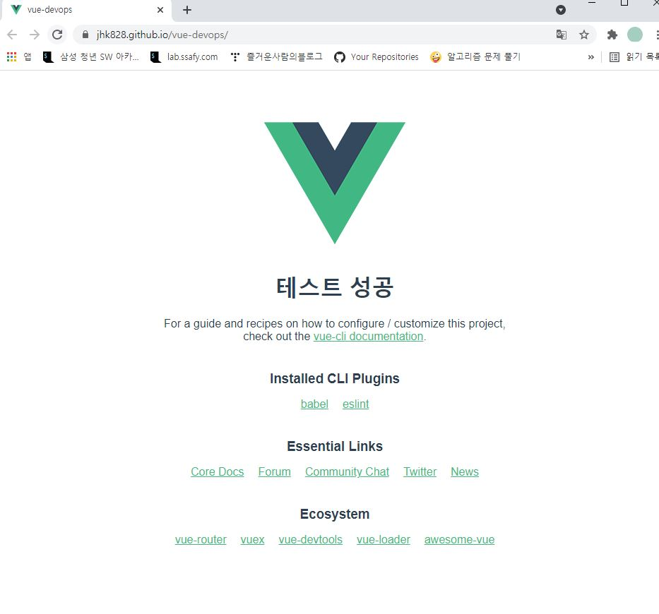

# Vue CLI 프로젝트 기반 DevOps 개발환경 실습
## 목표
- Vue.js CLI로 생성된 프로젝트를 빌드하고 GitHub Pages를 통해 정적 페이지를 배포 (Deploy) 한다.
- GitHub Actions를 통해 워크플로우를 구성하여 배포 자동화를 한다.

## 1. Vue 프로젝트 생성 및 로컬 실행 확인
Node.js LST, yarn 최신 버전은 이미 설치되어 있다고 가정한다. WSL2 환경에서 진행하였다.

> `yarn`은, Facebook에서 만든 자바스크립트 패키지 매니저다.

1. Vue 프로젝트 생성

```sh
# 1. yarn 설치 후 Vue CLI 설치, 버전 확인, git config 설정
$ yarn global add @vue/cli
$ vue -V
@vue/cli 4.5.13
$ git config --global user.name "username"
$ git config --global user.email username@gmail.com

# 2. Vue 프로젝트 설정
$ vue create vue-devops
# 선택 항목 : Manual select features, Unit Testing 추가 선택, 3.x, ESLint + Prettier, Lint on save, Jest, In dedicated config files, N

# 3.local 브라우저에서 에서 실행 확인
$ cd vue-devops
/vue-devops$ yarn serve
```


2. GitHub에 vue-devops 프로젝트 생성 후, local의 vue-devops 폴더 commit


## 2. GitHub Pages에 수동 배포
1. GitHub Pages 배포를 위한 라이브러를 추가 

```shell
# vue-devops 폴더에서 작업한다.
yarn add gh-pages -D
```

2. `package.json` 에 배포 설정

```json
{
  "name": "vue-devops",
  "version": "0.1.0",
  "private": true,
  "homepage": "https://jhk828.github.io/vue-devops/",
  "scripts": {
    "serve": "vue-cli-service serve",
    "build": "vue-cli-service build",
    "predeploy": "vue-cli-service build",
    "deploy": "gh-pages -d dist",
    "clean": "gh-pages-clean",
    "lint": "vue-cli-service lint"
  },
   .. 이하 생략
}

```

3. 프로젝트 최상단에 배포용 publicPath 설정

`vue.config.js`

```javascript
module.exports = {
    publicPath: "/vue-devops/",
    outputDir: "dist",
};
```

4. 정적 파일을 원격 저장소에 배포한다. `gh-pages` 브랜치가 생성되어서 푸시된다.

```shell
jhk@LAPTOP-ABE0IP8S:/mnt/c/git/vue-devops$ yarn deploy
yarn run v1.22.5
$ vue-cli-service build

⠸  Building for production...

 DONE  Compiled successfully in 5754ms                                                      3:42:50 PM

  File                                 Size                          Gzipped

  dist/js/chunk-vendors.381ed007.js    82.10 KiB                     30.82 KiB
  dist/js/app.799c49b8.js              4.52 KiB                      1.64 KiB
  dist/css/app.09e84613.css            0.33 KiB                      0.23 KiB

  Images and other types of assets omitted.

 DONE  Build complete. The dist directory is ready to be deployed.
 INFO  Check out deployment instructions at https://cli.vuejs.org/guide/deployment.html

$ gh-pages -d dist
Published
Done in 19.08s
```

5. https://jhk828.github.io/vue-devops/ 에 접속하여 배포 확인

   

## 3. GitHub Actions workflow로 배포 자동화

1. GitHub Actions의 Simple workflow 파일 (deploy.yml) 작성 후 commit

   1. `Set up this workflow` 클릭
   2. 파일 명 `deploy.yml`, 파일 내 name: `Deployment` 변경
   3. `Start Commit` -> `Commit new file` 클릭

2. commit 후 workflow 동작 확인

   

3. `git pull` 명령어로 `deploy.yml` 파일을 내려받는다.

4. vue 프로젝트 화면 수정

5. 배포 스크립트인 workflow 파일 (deploy.yml) 내용 수정

   ```yml
   jobs:
     build:
       runs-on: ubuntu-latest
       steps:
         - name: Checkout source code
           uses: actions/checkout@master
   
         - name: Set up Node.js
           uses: actions/setup-node@master
           with:
             node-version: 14.x
           
         - name: Install dependencies
           run: yarn install
   
         - name: Build page
           run: yarn build
           env:
             NODE_ENV: production
         
         - name: Deploy to gh-pages
           uses: peaceiris/actions-gh-pages@v3
           with:
             github_token: ${{ secrets.GITHUB_TOKEN }}
             publish_dir: ./dist
   
   ```

   6. push 후 Workflow 동작 결과와 자동 배포된 사이트 변경 내용 확인

      
